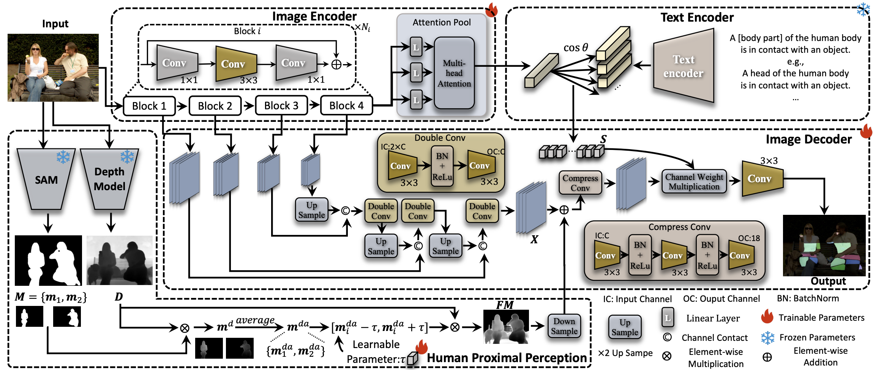

# P3HOT
代码和论文随后开源。

  <h1 align="center">Prompt Guidance and Human Proximal Perception for HOT Prediction with Regional Joint Loss</h1>
  

    <strong>Yuxiao Wang</strong>, <strong>Yu Lei</strong>, <strong>Zhenao Wei</strong>, <strong>Weiying Xue</strong>, <strong>Xinyu Jiang</strong>, <strong>Nan Zhuang</strong>, <strong>Qi Liu*</strong>
  

  <h2 align="center">Accepted by ICCV 2025</h2>
  

    
  

